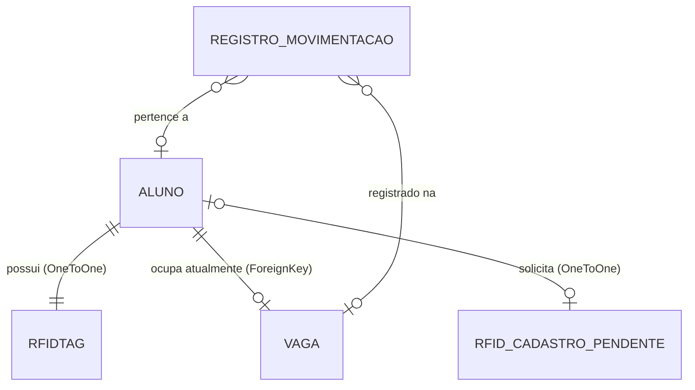

# Documentação Técnica do Projeto Bikot (Bicicletário IoT)

O **Bikot** é um sistema de controle de acesso e monitoramento de vagas de bicicletário inteligente baseado em IoT. A plataforma integra um backend em Django com hardwares externos (como ESP32) por meio de comunicação Serial direta e APIs HTTP REST seguras, permitindo a gestão em tempo real das vagas, cadastro ágil de usuários com tags RFID e telemetria de visualização pública.

---

## 1. Arquitetura do Sistema

O projeto é estruturado como um monolito Django utilizando o padrão MVT (Model-View-Template) com APIs auxiliares para comunicação de dados e integração de hardware via Wi-Fi/Internet.

```mermaid
graph TD
    subgraph Plataforma Web Django (Servidor na Nuvem/Local)
        Admin[Navegador Administrador / Web Admin]
        TV[Painel de Telemetria / TV]
        DB[(Banco de Dados SQLite)]
        Views[Django Views & APIs]
    end

    subgraph Hardware IoT (Conectado via Wi-Fi/Internet)
        Hardware[ESP32 / Placa Física com RFID e Trava]
    end

    Admin -->|HTTP / HTML / AJAX| Views
    TV -->|HTTP / JSON polling| Views
    Views -->|Query / Save| DB

    Hardware -->|HTTP REST APIs - POST Scan / GET Status| Views
```

### Componentes Principais

1. **Django Web Application (Core App)**: Interface administrativa protegida por autenticação que permite o gerenciamento completo de alunos, vagas, crachás RFID, logs de acesso e avisos informativos.
2. **REST API Endpoints**: Endpoints isentos de proteção CSRF e validados via chave secreta de API (`X-API-Key`) para leitura e escrita de vagas e tags diretamente pelo hardware conectado à internet (via Wi-Fi).
3. **Mecanismo de Telemetria (TV)**: Tela de exibição em tempo real otimizada para televisores e monitores locais no bicicletário, atualizada dinamicamente por requisições AJAX.

---

## 2. Modelagem de Dados (Banco de Dados)

O banco de dados do sistema é baseado em **SQLite** e compreende as seguintes tabelas e relacionamentos:



### Detalhamento das Entidades

*   **`RFIDTag` (Tag RFID)**: Armazena o código de identificação do crachá físico.
    *   `uid` (CharField, Unique): UID do crachá RFID (normalizado em letras maiúsculas e sem espaços).
    *   `ativo` (BooleanField): Status da permissão de acesso.
*   **`Aluno`**: Cadastro dos estudantes autorizados a usar o bicicletário.
    *   `nome` (CharField): Nome completo do aluno.
    *   `matricula` (CharField, Unique): Matrícula acadêmica do aluno.
    *   `email` (EmailField): Endereço de e-mail institucional.
    *   `rfid` (OneToOneField, Nullable): Associação ao crachá cadastrado.
*   **`Vaga`**: Vagas físicas disponíveis no bicicletário.
    *   `numero` (IntegerField, Unique): Número de identificação da vaga (ex: Vaga 1, Vaga 2).
    *   `status` (CharField): Estado atual da vaga (`disponivel`, `ocupada`, `bloqueada`).
    *   `aluno_atual` (ForeignKey para Aluno, Nullable): Indica qual aluno está utilizando a vaga.
    *   `pending_unlock` (BooleanField): Sinalização física. Define se existe um comando de destravamento de solenoide aguardando leitura do microcontrolador.
*   **`RegistroMovimentacao`**: Histórico completo de eventos do sistema para auditoria.
    *   `aluno` (ForeignKey, Nullable): Aluno autor do evento.
    *   `rfid_uid` (CharField): UID lido no momento da ação (registrado mesmo se não houver aluno cadastrado).
    *   `vaga` (ForeignKey, Nullable): Vaga em que ocorreu a movimentação.
    *   `acao` (CharField): Ações gravadas: `entrada`, `saida`, `liberacao_manual`, `bloqueio`, `desbloqueio`, `destravamento_remoto`.
    *   `timestamp` (DateTimeField, auto_now_add): Data/Hora exata do evento.
*   **`RFIDCadastroPendente`**: Sessão de cadastro temporária.
    *   `aluno` (OneToOneField): Aluno que receberá a nova tag RFID.
    *   `status` (CharField): Status da sessão (`pending`, `success`, `failed`).
    *   `scanned_uid` (CharField, Nullable): UID escaneado fisicamente para ser associado.
    *   `timestamp` (DateTimeField): Data de início do fluxo para expiração de sessão.
*   **`Aviso`**: Avisos gerais para a comunidade acadêmica.
    *   `titulo` (CharField): Título do aviso.
    *   `texto` (TextField): Conteúdo explicativo.
    *   `link` (URLField, Nullable): Link associado (gera QR Code de redirecionamento no painel de TV).
    *   `foto` (FileField, Nullable): Imagem de anúncio/foto (upload realizado para a pasta `avisos/`).
    *   `foto_fit` (CharField, Choice): Estilo de ajuste da foto na TV (`cover` para preencher a tela inteira com cortes ou `contain` para ajustar sem efetuar cortes).
    *   `data_expiracao` (DateTimeField, Nullable): Data e hora em que o aviso expira e deixa de ser exibido automaticamente.
    *   `ativo` (BooleanField): Se deve ou não ser exibido na Telemetria.
    *   `timestamp` (DateTimeField): Data de criação.
*   **`Configuracao`**: Configurações dinâmicas de comportamento do sistema no banco de dados.
    *   `chave` (CharField, Unique): Identificador único da configuração (ex: `tempo_exibicao_avisos`).
    *   `valor` (CharField): Valor correspondente armazenado como texto (ex: `6` segundos).

---

## 3. Segurança e Variáveis de Ambiente

As configurações de segurança são definidas no arquivo [settings.py](file:///c:/Users/Mariano/Documents/git/bikeiot/bikot/bikot/settings.py). 

### Variáveis de Ambiente Suportadas

O sistema lê as configurações principais a partir de variáveis de ambiente. Em produção, configure-as corretamente:

| Variável | Descrição | Valor Padrão |
| :--- | :--- | :--- |
| `SECRET_KEY` | Chave de segurança criptográfica do Django. | Chave de desenvolvimento insegura |
| `DEBUG` | Define se o Django roda em modo depuração (`True`/`False`). | `True` |
| `ALLOWED_HOSTS` | Domínios e IPs permitidos para acessar a aplicação (separados por vírgula). | `localhost,127.0.0.1` |
| `ESP32_API_KEY` | Token de validação que a ESP32 deve enviar no cabeçalho ou URL. | `dev-key-bikot-2026` |
| `JWT_SECRET_KEY` | Chave de assinatura criptográfica dos tokens JWT. | Utiliza a `SECRET_KEY` do Django por padrão |
| `DB_NAME` | Nome do Banco de Dados PostgreSQL. | Se não definido, o sistema usa SQLite (`db.sqlite3`) |
| `DB_USER` | Usuário do Banco de Dados PostgreSQL. | N/A |
| `DB_PASSWORD` | Senha do Banco de Dados PostgreSQL. | N/A |
| `DB_HOST` | Host do Banco de Dados PostgreSQL. | `localhost` |
| `DB_PORT` | Porta do Banco de Dados PostgreSQL. | `5432` |

### Autenticação via JWT (JSON Web Tokens)

O sistema suporta autenticação via JWT para clientes de API modernos e integrações externas. A autenticação baseia-se em um modelo de dois tokens:
- **Access Token**: Token de curta duração (padrão de 60 minutos) que deve ser enviado no cabeçalho HTTP: `Authorization: Bearer <TOKEN_DE_ACESSO>`.
- **Refresh Token**: Token de longa duração (padrão de 7 dias) que serve exclusivamente para renovar e obter um novo Access Token expirado.

A validação do token é feita pelo decorador personalizado [jwt_required](file:///c:/Users/Mariano/Documents/git/bikeiot/bikot/core/views.py#L69-L95) ou pela função interna [authenticate_jwt](file:///c:/Users/Mariano/Documents/git/bikeiot/bikot/core/views.py#L97-L118) no backend.

### Mecanismo de Autenticação de Dispositivos e Integrações

A função centralizada [validate_api_key](file:///c:/Users/Mariano/Documents/git/bikeiot/bikot/core/views.py#L120-L140) é utilizada para proteger as rotas da API e realiza uma verificação em cascata na seguinte ordem de prioridade:

1.  **Autenticação via JWT**: Verifica a presença e validade de um Bearer token no cabeçalho `Authorization`. Se válido, associa o usuário autenticado à requisição (`request.user`).
2.  **Autenticação via Sessão Django**: Se a requisição contiver um cookie de sessão válido de um administrador conectado pelo navegador, o acesso é liberado de forma transparente.
3.  **Autenticação por Chave de API (Tradicional da ESP32)**: Se as anteriores falharem, o sistema exige o envio da chave secreta configurada em `ESP32_API_KEY` por meio de um destes canais:
    - Cabeçalho HTTP: `X-API-Key: <CHAVE>`
    - Parâmetro de URL (Query): `?api_key=<CHAVE>`
    - Corpo do Formulário ou JSON (POST): `api_key=<CHAVE>`

---

## 4. Referência das APIs REST (Endpoints HTTP)

Todas as rotas voltadas para integração começam com `/api/`. O payload de envio e a resposta são estruturados em formato JSON.

### 4.1 Enviar Leitura de RFID (Scan)

Utilizado pelo hardware para notificar que um crachá foi aproximado do leitor. O backend decide o fluxo com base no estado do banco de dados (Estacionamento, Retirada ou Cadastro de RFID) e retorna o código correspondente (**1** para liberar vaga, **2** para cadastro ou **3** para erro/acesso negado).

*   **URL**: `/api/rfid/scan/`
*   **Método**: `POST` ou `GET`
*   **Cabeçalhos Requeridos**:
    *   `Content-Type: application/json`
    *   `X-API-Key: dev-key-bikot-2026`
*   **Parâmetros de Consulta Opcionais**:
    *   `format`: Se definido como `text` (`?format=text`), o endpoint responderá apenas o caractere numérico cru (`1`, `2` ou `3`) com tipo MIME `text/plain` e o respectivo código HTTP correspondente.
*   **Payload do Request (JSON)**:
    ```json
    {
      "uid": "11 22 33 44",
      "format": "json" // Opcional: "json" ou "text"
    }
    ```
*   **Respostas**:
    *   **Caso 1: Cadastro de RFID Pendente (Código 2)**: Se houver um fluxo de cadastro aberto no painel web para um aluno, a tag é cadastrada, associada a ele e o status da sessão muda para `success`. Se essa tag já estava cadastrada em outro aluno, ela será desvinculada dele automaticamente.
        *   *Código HTTP*: `200 OK`
        *   *Corpo JSON*:
            ```json
            {
              "codigo": 2
            }
            ```
        *   *Corpo Texto Cru (com `format=text`)*: `2`
    *   **Caso 2: Entrada / Estacionar Bicicleta (Código 1)**: O aluno possui cadastro, o crachá está ativo e ele não possui nenhuma bicicleta no estacionamento. O sistema aloca a primeira vaga livre para ele.
        *   *Código HTTP*: `200 OK`
        *   *Corpo JSON*:
            ```json
            {
              "codigo": 1
            }
            ```
        *   *Corpo Texto Cru (com `format=text`)*: `1`
    *   **Caso 3: Saída / Retirar Bicicleta (Código 1)**: O aluno já possui uma bicicleta estacionada. O sistema libera a vaga atual ocupada por ele.
        *   *Código HTTP*: `200 OK`
        *   *Corpo JSON*:
            ```json
            {
              "codigo": 1
            }
            ```
        *   *Corpo Texto Cru (com `format=text`)*: `1`
    *   **Caso 4: Crachá Inválido / Não Cadastrado / Inativo (Código 3)**: Se a tag não estiver vinculada a nenhum aluno, inativa ou sem cadastro iniciado.
        *   *Código HTTP*: `403 Forbidden`
        *   *Corpo JSON*:
            ```json
            {
              "codigo": 3
            }
            ```
        *   *Corpo Texto Cru (com `format=text`)*: `3`
    *   **Caso 5: Sem Vagas Disponíveis (Código 3)**:
        *   *Código HTTP*: `400 Bad Request`
        *   *Corpo JSON*:
            ```json
            {
              "codigo": 3
            }
            ```
        *   *Corpo Texto Cru (com `format=text`)*: `3`

---

### 4.2 Consultar Status das Vagas

Chamado periodicamente (polling) pela ESP32 para monitorar mudanças e verificar se há comandos de destravamento remotos ativos.

> [!IMPORTANT]
> Quando a ESP32 lê uma vaga que possui a propriedade `"pending_unlock": true`, o backend Django altera imediatamente o estado daquela propriedade para `false` no banco de dados para que o hardware físico processe a abertura da trava apenas uma vez por solicitação.

*   **URL**: `/api/vagas/`
*   **Método**: `GET`
*   **Cabeçalhos Requeridos**:
    *   `Authorization: Bearer <TOKEN_DE_ACESSO>` (Opcional)
*   **Resposta**:
    *   *Código HTTP*: `200 OK`
    *   *Corpo*:
        ```json
        [
          {
            "id": 1,
            "numero": 1,
            "status": "ocupada",
            "aluno": "Pedro Silva",
            "pending_unlock": false
          },
          {
            "id": 2,
            "numero": 2,
            "status": "disponivel",
            "aluno": null,
            "pending_unlock": true
          }
        ]
        ```

---

### 4.3 Liberar Vaga via API

Libera manualmente uma vaga, forçando a desassociação do aluno e retornando-a para o estado de disponível.

*   **URL**: `/api/vagas/liberar/`
*   **Método**: `POST`
*   **Cabeçalhos Requeridos**:
    *   `Content-Type: application/json`
    *   `X-API-Key: dev-key-bikot-2026`
*   **Payload do Request** (envie o `vaga_id` ou o `numero` da vaga):
    ```json
    {
      "numero": 3
    }
    ```
*   **Resposta**:
    *   *Código HTTP*: `200 OK`
    *   *Corpo*:
        ```json
        {
          "success": true,
          "message": "Vaga #3 liberada via API."
        }
        ```

---

### 4.4 Bloquear Vaga via API

Bloqueia uma vaga específica, impedindo que ela seja alocada em novas entradas. Se houver um aluno ocupando a vaga, ele é desassociado.

*   **URL**: `/api/vagas/bloquear/`
*   **Método**: `POST`
*   **Cabeçalhos Requeridos**:
    *   `Content-Type: application/json`
    *   `X-API-Key: dev-key-bikot-2026`
*   **Payload do Request** (envie o `vaga_id` ou o `numero` da vaga):
    ```json
    {
      "vaga_id": 3
    }
    ```
*   **Resposta**:
    *   *Código HTTP*: `200 OK`
    *   *Corpo*:
        ```json
        {
          "success": true,
          "message": "Vaga #3 bloqueada via API."
        }
        ```

---

### 4.5 Listar Avisos Ativos

Retorna a lista de todos os avisos marcados como ativos e dentro do período de validade (não expirados), junto com a configuração global do tempo de exibição na TV.

*   **URL**: `/api/avisos/`
*   **Método**: `GET`
*   **Cabeçalhos Requeridos**:
    *   `Authorization: Bearer <TOKEN_DE_ACESSO>` (Opcional)
*   **Resposta**:
    *   *Código HTTP*: `200 OK`
    *   *Corpo*:
        ```json
        {
          "tempo_exibicao": 6,
          "avisos": [
            {
              "id": 1,
              "titulo": "Manutenção Preventiva",
              "texto": "O bloco B estará fechado para manutenções nas travas elétricas no próximo sábado.",
              "link": "https://link-exemplo.com",
              "foto": "http://127.0.0.1:8000/media/avisos/manutencao.jpg",
              "foto_fit": "cover",
              "data_expiracao": "2026-06-15T18:00:00Z"
            }
          ]
        }
        ```

---

### 4.6 Consultar Status do Dispositivo (Polling Geral)

Endpoint público otimizado que a ESP32 pode consultar via HTTP GET a cada 1 ou 2 segundos para verificar se existem comandos globais pendentes na fila. O retorno pode vir em formato JSON ou texto cru (`format=text`).

*   **URL**: `/api/esp/status/`
*   **Método**: `GET`
*   **Cabeçalhos Requeridos**:
    *   `X-API-Key: dev-key-bikot-2026` ou `Authorization: Bearer <TOKEN_DE_ACESSO>` (se chamada externamente sem sessão)
*   **Parâmetros de Consulta Opcionais**:
    *   `format`: Se definido como `text` (`?format=text`), o endpoint responderá apenas o caractere numérico cru (`0`, `1` ou `2`) com tipo MIME `text/plain` e o respectivo código HTTP.
*   **Respostas**:
    *   **Caso 1: Cadastro Pendente Ativo (Código 2)**: Há uma tela de cadastro aberta esperando a leitura da tag.
        *   *Corpo JSON*: `{"codigo": 2, "mensagem": "Modo cadastro ativo"}`
        *   *Corpo Texto Cru (com `format=text`)*: `2`
    *   **Caso 2: Destravamento Pendente Ativo (Código 1)**: Há uma solicitação pendente para abrir a garra de alguma vaga. (O Django limpa a flag da vaga no banco após esta chamada para evitar múltiplas aberturas).
        *   *Corpo JSON*: `{"codigo": 1, "mensagem": "Destravamento pendente", "vaga": 1}`
        *   *Corpo Texto Cru (com `format=text`)*: `1`
    *   **Caso 3: Sem Comandos Pendentes / Aguardando (Código 0)**: Sem nenhuma ação a ser executada no microcontrolador.
        *   *Corpo JSON*: `{"codigo": 0, "mensagem": "Sem comandos pendentes"}`
        *   *Corpo Texto Cru (com `format=text`)*: `0`

---

### 4.7 Obter Token JWT

Autentica as credenciais de um usuário Django e retorna os tokens de Acesso (Access) e Atualização (Refresh) no formato JSON Web Token.

*   **URL**: `/api/token/`
*   **Método**: `POST`
*   **Cabeçalhos Requeridos**:
    *   `Content-Type: application/json`
*   **Payload do Request**:
    ```json
    {
      "username": "usuario_admin",
      "password": "senha_segura"
    }
    ```
*   **Respostas**:
    *   **Sucesso (200 OK)**:
        ```json
        {
          "success": true,
          "access": "eyJhbGciOiJIUzI1Ni...",
          "refresh": "eyJhbGciOiJIUzI1Ni..."
        }
        ```
    *   **Credenciais Inválidas (401 Unauthorized)**:
        ```json
        {
          "success": false,
          "message": "Credenciais de acesso inválidas."
        }
        ```
    *   **Campos Ausentes / Formato Inválido (400 Bad Request)**:
        ```json
        {
          "success": false,
          "message": "Os campos \"username\" e \"password\" são obrigatórios."
        }
        ```

---

### 4.8 Renovar Token JWT

Gera um novo Access Token a partir de um Refresh Token válido que ainda não expirou.

*   **URL**: `/api/token/refresh/`
*   **Método**: `POST`
*   **Cabeçalhos Requeridos**:
    *   `Content-Type: application/json`
*   **Payload do Request**:
    ```json
    {
      "refresh": "eyJhbGciOiJIUzI1Ni..."
    }
    ```
*   **Respostas**:
    *   **Sucesso (200 OK)**:
        ```json
        {
          "success": true,
          "access": "eyJhbGciOiJIUzI1Ni...",
          "refresh": "eyJhbGciOiJIUzI1Ni..."
        }
        ```
    *   **Token Inválido ou Expirado (401 Unauthorized)**:
        ```json
        {
          "success": false,
          "message": "Token expirado: Signature has expired"
        }
        ```

---

### 4.9 Listar Alunos Cadastrados

Retorna a lista completa contendo os alunos registrados, suas matrículas e UIDs das tags RFID associadas.

*   **URL**: `/api/alunos/`
*   **Método**: `GET`
*   **Cabeçalhos Requeridos**:
    *   `Authorization: Bearer <TOKEN_DE_ACESSO>` ou `X-API-Key: dev-key-bikot-2026`
*   **Respostas**:
    *   **Sucesso (200 OK)**:
        ```json
        [
          {
            "id": 1,
            "nome": "Pedro Silva",
            "matricula": "202310140",
            "rfid": "11 22 33 44"
          },
          {
            "id": 2,
            "nome": "Ana Souza",
            "matricula": "202310145",
            "rfid": null
          }
        ]
        ```
    *   **Não Autorizado (401 Unauthorized)**:
        ```json
        {
          "success": false,
          "message": "Não autorizado. Chave de API ou JWT inválido."
        }
        ```

---

## 5. Integração e Conectividade via Rede (Wi-Fi/Internet)

O sistema foi desenhado para ser implantado em um **servidor web remoto** (ou em rede local), e os microcontroladores (ESP32) conectam-se a ele exclusivamente via **Wi-Fi** consumindo as APIs REST (HTTP). A comunicação direta via cabo Serial (USB/COM) foi descontinuada do fluxo de produção oficial.

### Vantagens da Arquitetura em Rede
1. **Sem limite físico**: As vagas físicas e o leitor não precisam estar conectados ao mesmo computador do servidor.
2. **Escalabilidade**: Múltiplos bicicletários e placas ESP32 podem se comunicar com o mesmo servidor centralizado.
3. **Segurança**: Toda a comunicação é autenticada e validada pelo cabeçalho `X-API-Key`.

### Lógica da ESP32 conectada à Internet
1. **Inicialização**: A ESP32 conecta-se ao ponto de acesso Wi-Fi local e obtém acesso à internet.
2. **Ciclo de Polling**: O dispositivo envia requisições `GET` periódicas a cada 1.5 segundos para `/api/esp/status/?format=text` para ler comandos do servidor (modo de cadastro ou abertura manual de garras).
3. **Escaneamento (Scan)**: Ao ler uma tag RFID, a ESP32 interrompe temporariamente o polling e envia um `POST` para `/api/rfid/scan/?format=text` contendo o UID lido, interpretando o número de retorno (`1` para destravar, `2` para cadastro ou `3` para recusar) e efetuando a respectiva ação no hardware local.

---

## 6. Manual Operacional e de Instalação

### Requisitos Mínimos

*   Python 3.10 ou superior instalado.
*   Bibliotecas especificadas no `requirements.txt`:
    *   `Django >= 6.0`
    *   `pyserial` (para comunicação via cabo serial)

### Setup e Execução Local

1.  **Instale as dependências** no ambiente virtual (venv):
    ```bash
    # Ativar o ambiente virtual no Windows
    .\venv\Scripts\activate
    
    # Instalar os pacotes requeridos
    pip install -r requirements.txt
    ```

2.  **Execute as migrações** do banco de dados (inicializar tabelas):
    ```bash
    python manage.py migrate
    ```

3.  **Crie um superusuário** administrador para acessar o painel:
    ```bash
    python manage.py createsuperuser
    ```

4.  **Execute o servidor de desenvolvimento**:
    ```bash
    python manage.py runserver
    ```
    Acesse a interface administrativa no navegador pelo endereço: [http://127.0.0.1:8000/](http://127.0.0.1:8000/)

5.  **Populando Dados de Teste**:
    Para cadastrar automaticamente 10 vagas e 5 alunos com tags fictícias para simular e testar as rotas HTTP rapidamente, execute o seguinte comando:
    ```bash
    .\venv\Scripts\python manage.py setup_db
    ```

---

## 7. Instruções de Manutenção e Troubleshooting

### 7.1 Problema: A ESP32 não consegue liberar a trava elétrica
*   **Causa provável**: A flag `pending_unlock` da vaga no banco não está sendo alterada para `true`, ou a ESP32 está demorando muito para realizar a requisição HTTP GET para `/api/esp/status/` (limite de timeout).
*   **Como resolver**:
    1.  Verifique no painel administrativo (/admin) se o campo "Destravamento Pendente" da vaga desejada fica marcado como ativo quando você clica em "Destravar" no painel.
    2.  Verifique se a ESP32 está executando a chamada GET para `/api/esp/status/` em intervalos curtos (ex: a cada 1 ou 1.5 segundos) para capturar o pulso de abertura instantaneamente.

### 7.3 Problema: Erro "Não autorizado" (Erro 401) nas APIs
*   **Causa provável**: A chave de API (`ESP32_API_KEY`) enviada no cabeçalho `X-API-Key` ou na URL está ausente ou incorreta.
*   **Como resolver**:
    *   Verifique o arquivo `settings.py` ou a variável de ambiente do sistema operacional para ver a chave configurada.
    *   Certifique-se de que a requisição da ESP32 envia exatamente a chave no formato:
        *   No header: `X-API-Key: dev-key-bikot-2026`
        *   Ou na Query: `http://127.0.0.1:8000/api/rfid/scan/?api_key=dev-key-bikot-2026`
